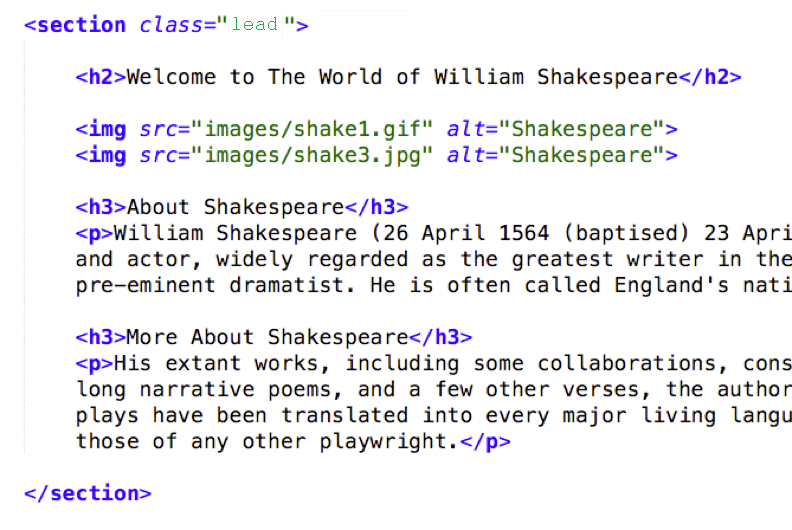
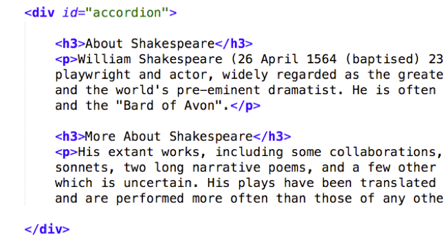

# CSC 170 Lab 14: JavaScript Plugins
*Due: Tuesday, November 20, 2018*

The goal of this lab assignment is to rip-out the simple JavaScript solutions you used on the homepage of your website and replace them with more elegant, jQuery-powered plugins.

You will need to be familiar with these two plugins:

- Super Simple Slider ([supersimpleslider.com](http://supersimpleslider.com))
- jQuery UI ([jqueryui.com](http://jqueryui.com)) 

...nothing for you to download here. We'll use CDNs for this plugin. Just follow the instructions below.


## Setup

- Make a copy of your **lab13** folder.  Call it **lab14**

- In the PHP Include file where you keep the HEAD, change the TITLE in the HEAD  to "Lab 14 - ..."  e.g.  `<title>Lab 14 - Shakespeare</title>` 

- In the **index.php** file rip out the "hover trick" JavaScript you used from Lab 14 by doing this...

	- Take the IMG element out of its FIGURE element - delete the FIGURE and FIGCAPTION elements.  Just leave the IMG under the "Welcome..." H2, by itself.
	- Remove the *onmouseover=""* and *onmouseout=""* attributes from the IMG
	- Create a second IMG element, right under the first, that points to your other image.  (The one you used for your *onmouseover*.)

- Rip out the "More..." JavaScript you used from Lab 13
	-	Remove the IDs you used to toggle the content
			Delete the BUTTON element between your two DIVs
		​	Delete the DIVs around your content (leave the content)
		​	In the file system, delete the folder and file: **js/scripts.js**
		​	In the index file, delete the script link to the **js/scripts.js** file

You'll end up with something that looks like this:


## Install Super Simple Slider
You need to install the plugin according to the instructions by the author.  In all, you need to do the following:
- Normally, you would download the plugin files from the author's website.  Instead, download this prepared set of files: [sss.zip](sss.zip)

- Extract the **sss** folder from the ZIP file and add it as-is to the **lab14** folder

- In the PHP Include file where you keep the HEAD, in the correct location add a link to the **sss/sss.css** file
  `<link rel="stylesheet" href="sss/sss.css">`

- In the **index** file wrap your IMGs in a new DIV with a `class="slider"`

- In the **index** file, in the correct location install the jQuery CDN (from Google)
  `<script src="http://ajax.googleapis.com/ajax/libs/jquery/1.9.0/jquery.min.js"></script>`

- In the **index** file, in the correct location install the SSS plugin `<script src="sss/sss.js"></script>`

- In the **index** file, in the correct location install an initialization string for the SSS plugin

  ```html
  <script>
  $('.slider').sss();
  </script>
  ```

## Install jQuery UI's Accordion Plugin
You need to install the plugin according to the instructions by the developers of jQuery UI.  In all, you need to do the following:

- NOTE: you must *not* re-install jQuery!  (You already installed it when you added SSS.)
- In the **index** file, in the correct location install the plugin script using a CDN that hosts the jQuery UI script

	```html
	<script src="http://code.jquery.com/ui/1.11.4/jquery-ui.js"></script>
	```

- In the **index** file, in the correct location install an initialization string for the jQuery UI plugin

	```html
	<script>
	$( "#accordion" ).accordion({
		heightStyle: "content"
	});
	</script>
	```

- In the PHP Include file where you keep the HEAD, install the CSS using the CDN that hosts the jQuery UI styles
`<link rel="stylesheet" href="http://code.jquery.com/ui/1.11.4/themes/smoothness/jquery-ui.css">`

- Wrap your content (a couple of headers and some paragraphs) in a new DIV with an `id="accordion"`

You should end up with something that looks like this:


## Check and Upload your Work
- Validate the HTML file ([http://validator.w3.org/](http://validator.w3.org/))

When you are done with your webpage, close everything and use an FTP tool (to access your account on **csc170.org** and upload your files:

- In a web browser (any), go to this address to check your handiwork: 
	```www.csc170.org/accountname/lab14/index.php```<br>
	(where *accountname* is your account name)

## Report your work
•	In our Blackboard section, in **Lab 14**, post a link to your webpage to receive credit for this Lab. 
